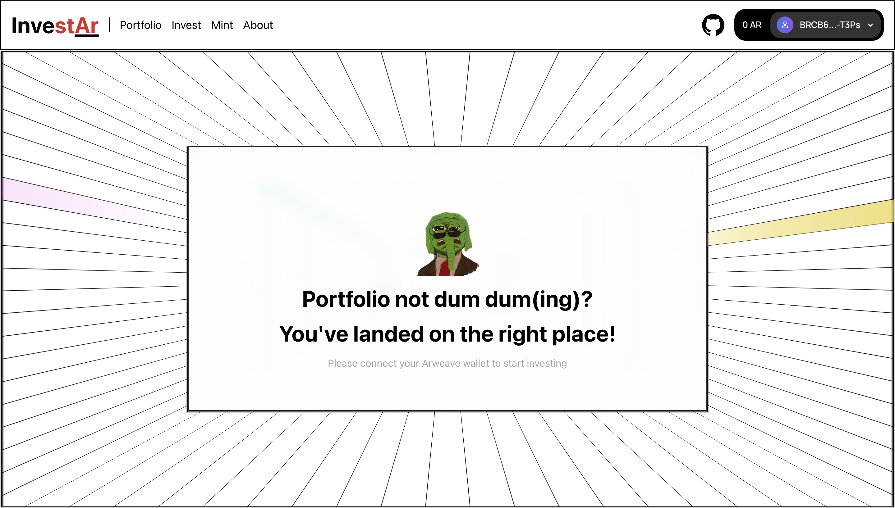

# InvestAr - Autonomous Investment Agent

InvestAr is a decentralized investment platform built on the Arweave network, enabling automated and transparent investment strategies. The platform leverages Arweave's permanent and decentralized storage capabilities to provide users with autonomous investment solutions while maintaining full control over their assets.



## Features

- **Automated Investment Strategies**: Currently implements dollar cost averaging (DCA) for STAR tokens
- **Decentralized Control**: Built on Arweave network ensuring transparency and user control
- **User-Friendly Interface**: Modern UI with intuitive portfolio management
- **Token Management**: Mint and manage STAR tokens for testing investment strategies
- **Real-Time Portfolio Tracking**: Monitor your investments and returns
- **Recurring Investments**: Set up automated investments on specific days of the month

## Tech Stack

- **Frontend**: Next.js 14, TypeScript, Tailwind CSS
- **Blockchain**: Arweave Network, AO Protocol
- **Smart Contracts**: Lua
- **Wallet Integration**: Arweave Wallet Kit
- **UI Components**: Radix UI, Framer Motion

## Getting Started

### Prerequisites

- Node.js (v18 or higher)
- Arweave Wallet
- Git

### Installation

1. Clone the repository:
```bash
git clone https://github.com/dharminnagar/autonomous-investment-agent.git
cd autonomous-investment-agent
```

2. Install dependencies:
```bash
npm install
```

3. Run the development server:
```bash
npm run dev
```

4. Open [http://localhost:3000](http://localhost:3000) in your browser

### Environment Setup

No additional environment variables are required for basic setup. The application uses default Arweave testnet configurations.

## Usage

1. **Connect Wallet**: Use the connect button in the header to link your Arweave wallet
2. **Mint Tokens**: Navigate to the Mint page to get test STAR tokens
3. **Create Investment**: Set up your investment strategy with:
   - Input/Output tokens
   - Investment amount
   - Recurring day of the month
4. **Monitor Portfolio**: Track your investments and returns in the Portfolio section

## Project Structure

```
autonomous-investment-agent/
├── app/                    # Next.js app directory
├── components/            # React components
├── lib/                   # Utility functions and configurations
├── lua/                   # Smart contract code
├── public/               # Static assets
└── styles/               # Global styles
```

## Contributing

1. Fork the repository
2. Create your feature branch (`git checkout -b feature/AmazingFeature`)
3. Commit your changes (`git commit -m 'Add some AmazingFeature'`)
4. Push to the branch (`git push origin feature/AmazingFeature`)
5. Open a Pull Request

## Team

- **Dharmin Nagar** - [GitHub](https://github.com/dharminnagar) | [Twitter](https://twitter.com/dharminnagar)
- **Yatharth Singh Panwar** - [GitHub](https://github.com/yatharth-singh-panwar) | [Twitter](https://twitter.com/yatharthpnwr)

## License

This project is licensed under the MIT License - see the [LICENSE](LICENSE) file for details.

## Acknowledgments

- Arweave Network
- AO Protocol
- The entire Web3 community
